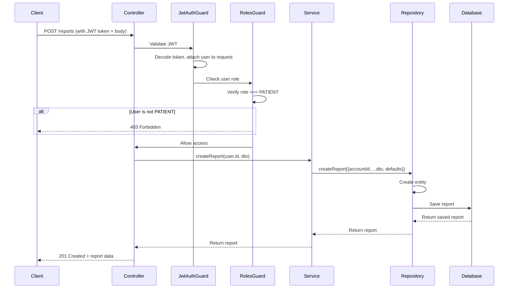

# Business Rules - Reports Module (Tạo Report)

## 🎯 Tổng Quan
Module Reports chịu trách nhiệm quản lý việc tạo và xử lý các báo cáo (reports) từ người dùng về lỗi hệ thống, nội dung không phù hợp, hoặc các vấn đề khác.

**Điều kiện tiên quyết:**
- Chỉ tài khoản có vai trò `PATIENT` mới có thể tạo report.
- Sử dụng RBAC Guard (`JwtAuthGuard` + `RolesGuard`) để kiểm tra quyền trước khi thực hiện action.
- Người dùng phải đăng nhập (có JWT token hợp lệ).

---

## 📋 Chức Năng: Tạo Report (Create Report)

### A. Phân Quyền (Authorization)

**Vai trò được phép:**
- ✅ `PATIENT` - Chỉ bệnh nhân mới có quyền tạo report

**Vai trò bị từ chối:**
- ❌ `ADMIN` - Không có quyền tạo report (chỉ xử lý/phản hồi)
- ❌ `CLINIC_ADMIN` - Không có quyền tạo report
- ❌ `CLINIC_MANAGER` - Không có quyền tạo report
- ❌ `CLINIC_STAFF` - Không có quyền tạo report
- ❌ `DOCTOR` - Không có quyền tạo report

**Cài đặt Guards:**
```typescript
@UseGuards(JwtAuthGuard, RolesGuard)
@Roles(AccountRole.PATIENT)
```

**Luồng kiểm tra:**
1. `JwtAuthGuard` xác thực JWT token và gắn thông tin user vào `request.user`
2. `RolesGuard` kiểm tra `request.user.role` có phải là `PATIENT` không
3. Nếu không phải PATIENT → HTTP 403 Forbidden
4. Nếu hợp lệ → Cho phép tiếp tục xử lý request

---

### B. Dữ Liệu Đầu Vào (Request Payload)

**DTO:** `CreateReportDto`

| Field | Type | Required | Validation | Example |
|-------|------|----------|------------|---------|
| `reportType` | `enum ReportType` | ✅ Bắt buộc | Phải thuộc enum `ReportType` | `"BUG"` |
| `description` | `string` | ✅ Bắt buộc | Không được rỗng | `"App crashes when booking"` |
| `reportImages` | `string[]` | ❌ Tùy chọn | Mỗi phần tử phải là string (URL) | `["https://example.com/img1.png"]` |

**Enum `ReportType` bao gồm:**
- `BUG` - Lỗi kỹ thuật
- `ABUSE` - Lạm dụng hệ thống
- `SPAM` - Nội dung spam
- `INAPPROPRIATE_CONTENT` - Nội dung không phù hợp
- `FRAUD` - Gian lận
- `OTHER` - Khác

**Ví dụ Request Body:**
```json
{
  "reportType": "BUG",
  "description": "The application crashes when I try to book an appointment with Dr. Smith",
  "reportImages": [
    "https://cloudinary.com/screenshots/crash-log-1.png",
    "https://cloudinary.com/screenshots/error-screen-2.png"
  ]
}
```

---

### C. Logic Xử Lý & Mapping Database

**Quy trình tạo Report:**

1. **Lấy Account ID từ User đã đăng nhập:**
   - Không lấy `account_id` từ request body
   - Lấy từ `request.user.id` (được gắn bởi `JwtAuthGuard`)
   - Controller truyền `user.id` vào Service method

   ```typescript
   // Controller
   async createReport(@User() user: any, @Body() dto: CreateReportDto) {
     return this.reportService.createReport(user.id, dto);
   }
   ```

2. **Tạo Entity Report với các giá trị:**
   - `accountId`: Lấy từ `user.id` (tham số của method)
   - `reportType`: Lấy từ `dto.reportType`
   - `description`: Lấy từ `dto.description`
   - `reportImages`: Lấy từ `dto.reportImages` (hoặc `[]` nếu không có)
   - `isResponse`: **Mặc định = `false`** (chưa được phản hồi)
   - `responseDescription`: **Mặc định = `null`** (chưa có phản hồi)

3. **Lưu vào Database:**
   - Gọi `reportRepository.createReport()` để tạo entity
   - Gọi `reportRepository.saveReport()` để persist vào DB
   - Trả về Report đã được lưu (với `_id` đã được generate)

**Mapping Database:**

| DTO Field | Entity Field | Database Column | Default Value | Note |
|-----------|--------------|-----------------|---------------|------|
| - | `accountId` | `account_id` | Từ `user.id` | UUID của PATIENT |
| `reportType` | `reportType` | `report_type` | - | Enum |
| `description` | `description` | `description` | - | Text |
| `reportImages` | `reportImages` | `report_images` | `[]` nếu null | Text Array |
| - | `isResponse` | `is_response` | `false` | Boolean |
| - | `responseDescription` | `response_description` | `null` | Text hoặc null |
| - | `createdAt` | `created_at` | Auto (DB) | Timestamp |
| - | `updatedAt` | `updated_at` | Auto (DB) | Timestamp |

---

### D. Response Trả Về

**Success Response (HTTP 201):**
```json
{
  "_id": "uuid-generated-123",
  "accountId": "patient-uuid-456",
  "reportType": "BUG",
  "description": "The application crashes when I try to book an appointment",
  "reportImages": ["https://example.com/img1.png"],
  "isResponse": false,
  "responseDescription": null,
  "createdAt": "2026-02-24T10:30:00.000Z",
  "updatedAt": "2026-02-24T10:30:00.000Z"
}
```

**Error Responses:**

| HTTP Code | Scenario | Message |
|-----------|----------|---------|
| 400 Bad Request | Thiếu `reportType` | Validation error (DTO) |
| 400 Bad Request | Thiếu `description` | Validation error (DTO) |
| 400 Bad Request | `reportType` không hợp lệ | Validation error (DTO) |
| 401 Unauthorized | Không có JWT token | Unauthorized |
| 403 Forbidden | User không phải PATIENT | Forbidden - Only patients can create reports |

---

### E. Ràng Buộc Dữ Liệu (Constraints)

**Bắt buộc (Required):**
- ✅ `reportType` - Không được thiếu, phải thuộc enum
- ✅ `description` - Không được rỗng

**Tùy chọn (Optional):**
- `reportImages` - Có thể null, undefined, hoặc array rỗng

**Ràng buộc khác:**
- `accountId` được lấy tự động từ user đăng nhập, **không cho phép** người dùng tự gửi
- `isResponse` luôn là `false` khi tạo mới
- `responseDescription` luôn là `null` khi tạo mới
- `reportImages` nếu không có thì default là `[]` (array rỗng)

---

### F. Business Rules Tổng Kết

1. **🔒 Phân Quyền:**
   - Chỉ PATIENT được tạo report
   - Guards kiểm tra ở Controller layer (không kiểm tra ở Service)

2. **📝 Dữ Liệu Bắt Buộc:**
   - `reportType` và `description` là bắt buộc
   - Validation được handle bởi class-validator trong DTO

3. **🔑 Account ID:**
   - Luôn lấy từ JWT token (`user.id`)
   - Không cho phép client tự gửi `accountId` trong body

4. **⚙️ Giá Trị Mặc Định:**
   - `isResponse` = `false`
   - `responseDescription` = `null`
   - `reportImages` = `[]` (nếu không có trong request)

5. **🗄️ Database:**
   - Report được lưu vào bảng `reports`
   - Foreign key liên kết với bảng `accounts` qua `account_id`

6. **📧 Email/Notification:**
   - Không gửi email khi tạo report
   - Email chỉ được gửi khi Admin phản hồi report (endpoint khác)

---

## 🔄 Luồng Hoạt Động (Flow)



---

## 📋 Chức năng: Báo cáo chi nhánh (Branch Reports) - Dành cho Manager

### A. Phân Quyền (Authorization)

**Vai trò được phép:**
- ✅ `CLINIC_MANAGER` - Chỉ quản lý chi nhánh mới có quyền xem báo cáo của chi nhánh mình.

**Cài đặt Guards:**
```typescript
@UseGuards(JwtAuthGuard, RolesGuard)
@Roles(AccountRole.CLINIC_MANAGER)
```

---

### B. Logic Lọc Dữ Liệu (Data Filtering Rules)

1. **🔒 Tự động lọc theo chi nhánh:**
   - Manager **không cần** gửi `clinicId` trong request.
   - Hệ thống tự động lấy `managerId` từ JWT token (`request.user.id`).
   - Dữ liệu luôn được lọc theo `clinic_id` của chi nhánh mà Manager đó quản lý.

2. **📅 Phân loại báo cáo theo thời gian (Period):**
   - Hỗ trợ 3 mức: `DAY` (Ngày), `MONTH` (Tháng), `YEAR` (Năm).
   - Mặc định nếu không gửi là `DAY`.

3. **🚫 Loại bỏ dữ liệu không hợp lệ:**
   - Các cuộc hẹn có trạng thái `CANCELLED` (Đã hủy) hoặc `ABSENT` (Vắng mặt) sẽ bị loại khỏi các thống kê số lượng và doanh thu.

---

### C. Chi tiết các loại báo cáo

#### 1. Thống kê khách hàng (Customer Statistics)
- **Mục tiêu:** Đếm số lượng bệnh nhân khác nhau đã đến khám.
- **Logic:** Sử dụng `COUNT(DISTINCT patient_id)` để tránh đếm lặp một người khám nhiều lần trong cùng kỳ.

#### 2. Thống kê phản hồi bác sĩ (Doctor Feedback & Working)
- **Mục tiêu:** Đánh giá chất lượng phục vụ của từng bác sĩ trong ngày.
- **Tham số bắt buộc:** `date` (YYYY-MM-DD).
- **Quy trình:**
    1. Lấy danh sách bác sĩ có lịch khám trong ngày tại chi nhánh.
    2. Tính điểm trung bình (`avgRating`) từ bảng `feedbacks`.
    3. Đếm tổng số lượt feedback.
    4. Trích xuất 5 feedback gần nhất để xem nội dung chi tiết.

#### 3. Thống kê dịch vụ (Service Statistics)
- **Mục tiêu:** Xem dịch vụ nào được sử dụng nhiều nhất và doanh thu từng loại.
- **Logic:**
    - `registrationCount`: Đếm số lượt đăng ký dịch vụ.
    - `totalRevenue`: Tổng số tiền thu được (tính từ giá trong cấu hình dịch vụ của chi nhánh).
- **Ràng buộc:** Phải `JOIN` đúng bảng `clinic_services` để lấy tên dịch vụ chính xác.

---

### D. Checklist Kiểm Tra

- [ ] Manager chỉ xem được dữ liệu của đúng chi nhánh mình quản lý.
- [ ] Tham số `date` cho báo cáo bác sĩ là bắt buộc (HTTP 400 nếu thiếu).
- [ ] Các cuộc hẹn `CANCELLED/ABSENT` không được tính vào thống kê.
- [ ] Tên dịch vụ hiển thị đúng, không bị lỗi alias SQL.
- [ ] Unit tests cho `BranchReportService` đạt coverage cao.
